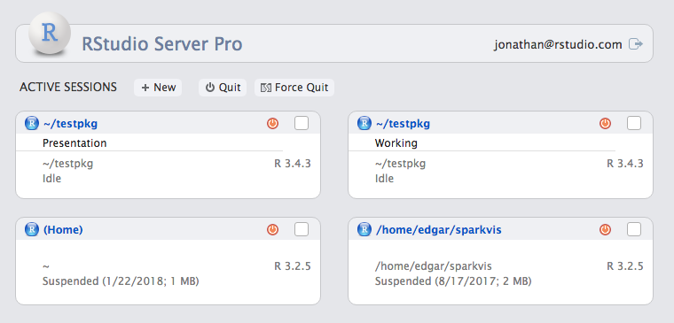
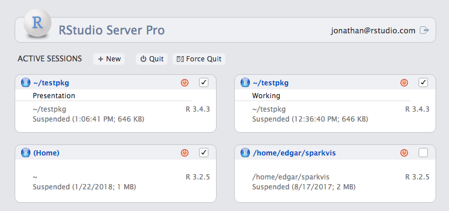

```{r setup, echo=FALSE}
library(DiagrammeR)
```

# RStudio Server Pro 1.1

# Agenda

## For Data Scientists

- Session Management
- Session Cleanup

## For Admins

- Notifications
- Session Cleanup
- Licensing in Docker/VMs

# Data Scientists

## Label Sessions


## Label Sessions



## Cleanup Sessions



# Admins

## Session Cleanup

    session-timeout-kill-hours=168

- Prevent runaway resource usage
- Clean up old sessions and recover their disk space.

## Notifications


## Notifications

    /etc/rstudio/notifications.conf

- Set message start time/end time
- Notification will be delivered to each user session
- Scriptable

## Licensing in Docker / VMs

```{r, echo=FALSE}
grViz(diagram = "gv/turboactivate.gv")
```

